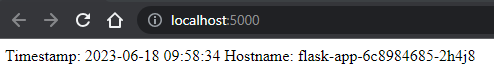
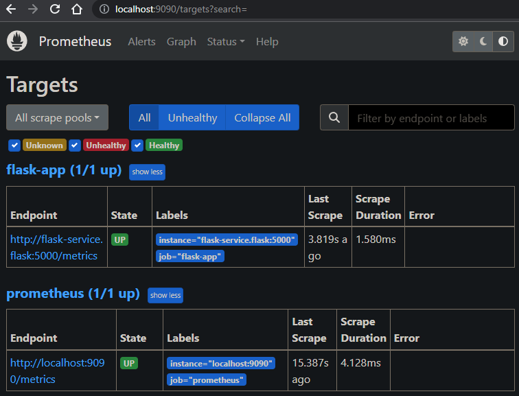

# Flask Application with Kubernetes Deployment

This Flask application is designed to handle HTTP GET requests and provide a response that includes the current timestamp and the hostname of the server. When a GET request is made to the application, it generates a response containing the timestamp, which indicates the exact moment the request was processed, and the hostname, which identifies the server on which the application is running.

## Build the Application

To build the application, follow these steps:

1. Clone the repository:

   ```shell
   git clone https://github.com/lahiruperamune/flask-app.git
    ```
2. Navigate to the project directory:

    ```shell
    cd flask-app/app
    ```

3. Build the docker image with the application:

    ```shell
    docker build -t {dockerimagename} .
    ```

Now the docker image is ready for deployment.

## Application Deployment
To deploy the application in your Kubernetes environment, follow these steps:

1. Back to the root folder:

   ```shell
   cd ..
    ```
    open  `deployment.yaml` and replace the image name with your newly created image name in line number [17](https://github.com/lahiruperamune/flask-app/blob/main/deployment.yaml#L17). Or else you can use the original image  `lahiruperamune/flaskapp:latest`.

2. Make 2 different namespaces for the application and monitoring:

   ```shell
   kubectl create ns flask
   kubectl create ns monitoring
    ```
3. Deploy the Kubernetes manifest for the application:

   ```shell
   kubectl apply -f deployment.yaml -n flask
   kubectl apply -f service.yaml -n flask
   kubectl apply -f ingress.yaml -n flask
    ```
4. Deploy the Kubernetes manifest for Prometheus monitoring:

   ```shell
   kubectl apply -f monitoring.yaml -n monitoring
    ```
5. Now you should be able to access the application through port forwarding:
   ```shell
   kubectl port-forward pod/{flask-podID} 5000:5000  -n flask
    ```
     The Flask application should now be running locally. You can access it at http://localhost:5000.
   

7. Port forward the Prometheus pod:
   ```shell
   kubectl port-forward pod/{prometheus-podID} 9090:9090 -n monitoring
    ```
    You can access the Prometheus interface via http://localhost:9090.
   


